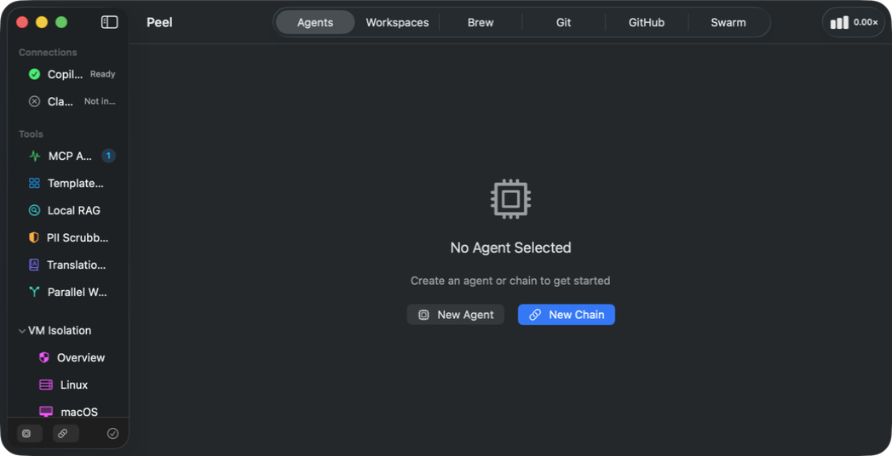
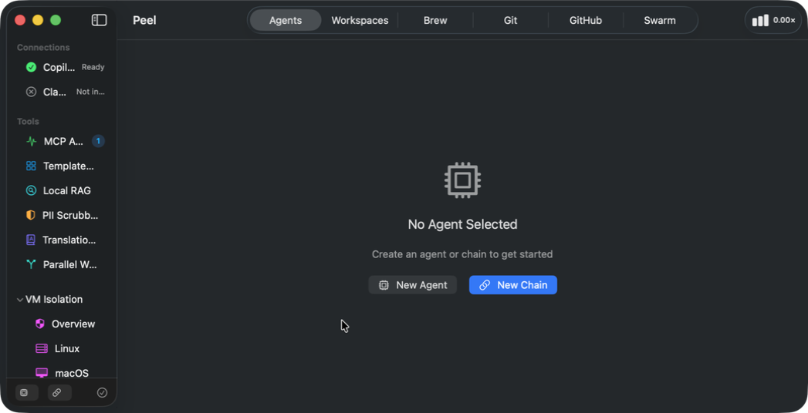
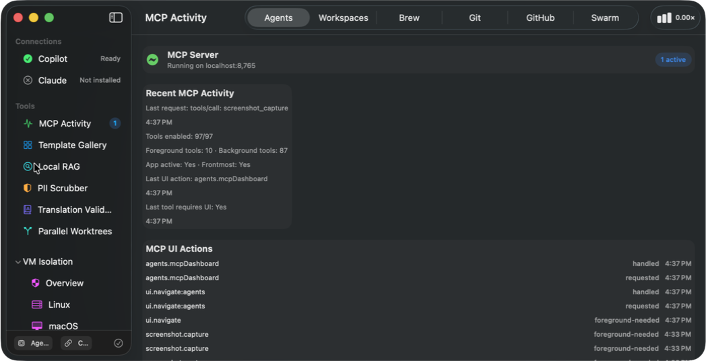
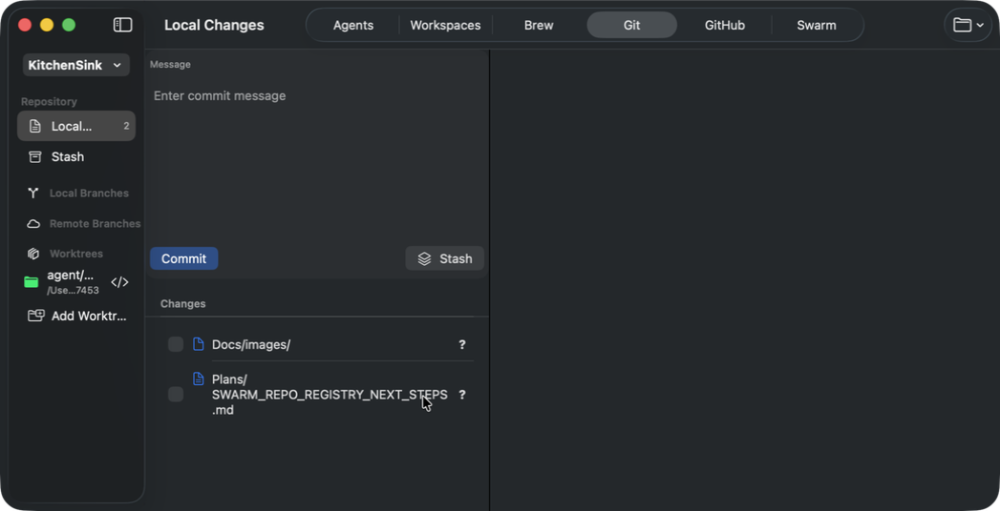
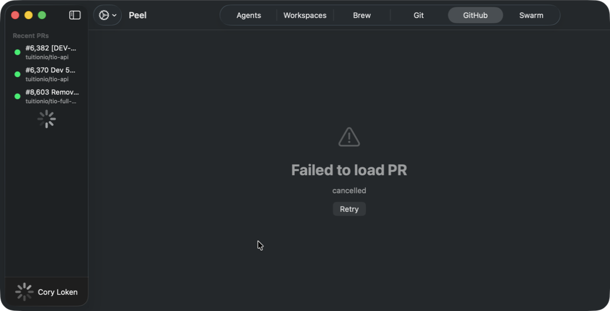
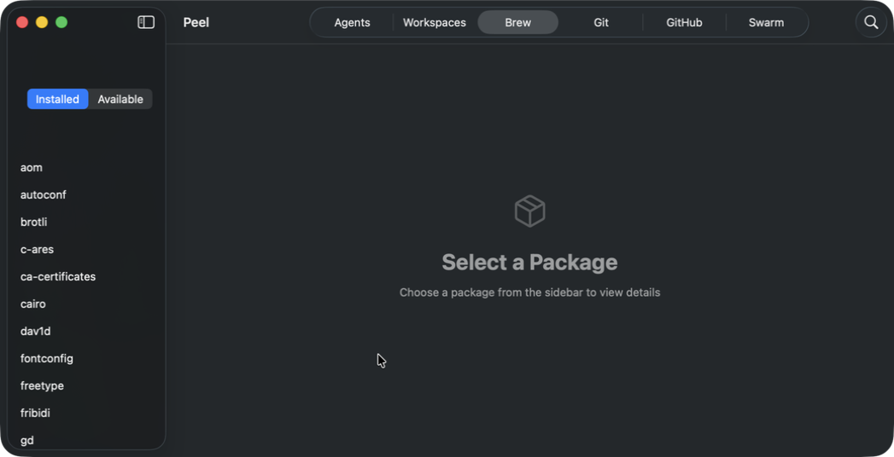
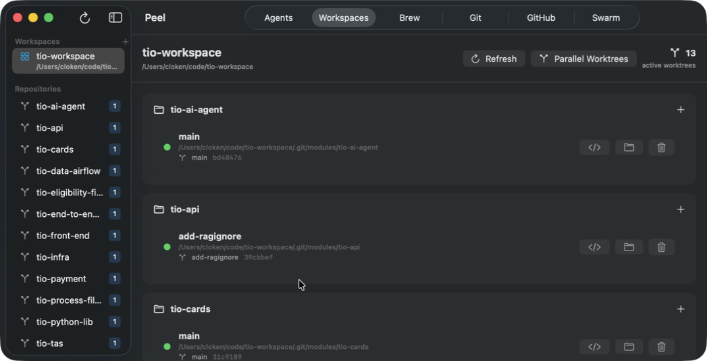

# Peel Product Manual

> "Peel back the layers" of your dev environment

**Version:** 0.9 (Pre-release)  
**Platforms:** macOS 26+, iOS 26  
**Last Updated:** January 28, 2026

---

## Table of Contents

1. [Overview](#overview)
2. [Getting Started](#getting-started)
3. [Core Features](#core-features)
   - [Agents & Chains](#agents--chains)
   - [MCP Server](#mcp-server)
   - [Local RAG](#local-rag)
   - [Parallel Worktrees](#parallel-worktrees)
   - [Distributed Swarm](#distributed-swarm)
   - [Prompt Rules](#prompt-rules-guardrails)
   - [Template Gallery](#template-gallery)
   - [PII Scrubber](#pii-scrubber)
   - [Translation Validation](#translation-validation)
   - [VM Isolation](#vm-isolation)
4. [Integrations](#integrations)
   - [Git](#git)
   - [GitHub](#github)
   - [Homebrew](#homebrew)
   - [Workspaces](#workspaces)
5. [MCP API Reference](#mcp-api-reference)
6. [Configuration](#configuration)
7. [Troubleshooting](#troubleshooting)

---

## Overview

Peel is a macOS/iOS application for managing your development environment. It provides:

- **AI Agent Orchestration** - Run AI coding agents with review gates and isolated worktrees
- **Local RAG** - Index and search your codebase with on-device embeddings
- **MCP Server** - Model Context Protocol server for IDE integration
- **Git/GitHub Management** - Repository, branch, and PR management
- **Homebrew** - Package management interface
- **Workspace Dashboard** - Multi-repo project management

### Architecture

```
┌─────────────────────────────────────────────────────────────┐
│                        Peel App                              │
├─────────────────────────────────────────────────────────────┤
│  ┌─────────┐  ┌─────────┐  ┌─────────┐  ┌─────────┐        │
│  │ Agents  │  │   Git   │  │ GitHub  │  │  Brew   │        │
│  └────┬────┘  └────┬────┘  └────┬────┘  └────┬────┘        │
│       │            │            │            │              │
│  ┌────┴────────────┴────────────┴────────────┴────┐        │
│  │              MCP Server (port 8765)             │        │
│  │     JSON-RPC interface for external tools       │        │
│  └─────────────────────────────────────────────────┘        │
│                           │                                  │
│  ┌────────────────────────┴────────────────────────┐        │
│  │              Local RAG Store (SQLite)            │        │
│  │   File chunks, embeddings, semantic search       │        │
│  └──────────────────────────────────────────────────┘        │
└─────────────────────────────────────────────────────────────┘
```



---

## Getting Started

### Installation

1. Download Peel from [releases page] *(placeholder)*
2. Move to `/Applications`
3. Launch Peel
4. Grant necessary permissions (File Access, Accessibility if using VM features)

### First Launch

On first launch, Peel will:
1. Initialize the MCP server on port 8765
2. Create the Local RAG database
3. Check for CLI tools (GitHub Copilot CLI, Claude CLI)

### Connecting to IDEs

Peel's MCP server can be used with any MCP-compatible IDE:

```json
// VS Code settings.json
{
  "mcp.servers": {
    "peel": {
      "url": "http://127.0.0.1:8765/rpc"
    }
  }
}
```

---

## Core Features

### Agents & Chains

**Location:** Sidebar → Agents tab



Agents are AI coding assistants that can execute tasks in your codebase. Chains are sequences of agent tasks with review gates.

#### Creating an Agent

1. Click **Agent** button in sidebar footer
2. Select CLI tool (Copilot or Claude)
3. Configure the agent settings
4. Agent appears in "Agents" section

#### Creating a Chain

1. Click **Chain** button in sidebar footer
2. Enter chain name and select project
3. Define tasks with prompts
4. Choose template (optional)
5. Start chain execution

#### Review Gates

Chains pause at review gates, allowing you to:
- Review changes made by the agent
- Approve and continue to next task
- Reject and provide feedback
- Stop the chain entirely

#### Chain States

| State | Description |
|-------|-------------|
| Idle | Not started |
| Running | Actively executing |
| Reviewing | Paused at review gate |
| Complete | All tasks finished |
| Failed | Error occurred |

---

### MCP Server

**Location:** Sidebar → Tools → MCP Activity



The Model Context Protocol server exposes Peel's functionality to external tools via JSON-RPC.

#### Status Indicators

- 🟢 **Running** - Server is active and accepting connections
- 🔴 **Stopped** - Server is not running
- **Active Requests** - Badge shows in-flight requests

#### Viewing Activity

The MCP Dashboard shows:
- Recent requests with timing
- Request/response payloads
- Error details
- Tool invocation history

#### Session Tracking

Click the usage indicator in the toolbar to see:
- Premium request multiplier used
- Token consumption
- Cost breakdown by model

---

### Local RAG

**Location:** Sidebar → Tools → Local RAG

Local Retrieval-Augmented Generation indexes your codebase for semantic search, entirely on-device.

#### Indexing a Repository

1. Navigate to Local RAG dashboard
2. Enter repository path (e.g., `/Users/you/code/myproject`)
3. Click **Index Repository**
4. Wait for indexing to complete

#### Search Modes

| Mode | Description | Best For |
|------|-------------|----------|
| Text | Keyword matching with AND/OR | Exact code snippets, function names |
| Vector | Semantic similarity using embeddings | Conceptual queries ("how does auth work") |

#### Search Filters

| Filter | Description |
|--------|-------------|
| `excludeTests` | Skip test/spec files |
| `constructType` | Filter by type: `function`, `classDecl`, `component`, `method` |
| `matchAll` | For text mode: `true` = AND all words, `false` = OR any word |

#### Embedding Providers

Configure via MCP (`rag.config`) or app settings:

| Provider | Description | Quality |
|----------|-------------|---------|
| `mlx` | MLX native (default on Apple Silicon) | ⭐⭐⭐ Best |
| `coreml` | CoreML compiled model | ⭐⭐⭐ Best |
| `system` | Apple NLEmbedding | ⭐⭐ Good |
| `hash` | Fallback hash-based | ⭐ Basic |

#### MLX Model Selection

List and set preferred MLX models:

```bash
# List available models
curl -X POST http://127.0.0.1:8765/rpc \
  -d '{"jsonrpc":"2.0","id":1,"method":"tools/call","params":{"name":"rag.model.list","arguments":{}}}'

# Set preferred model
curl -X POST http://127.0.0.1:8765/rpc \
  -d '{"jsonrpc":"2.0","id":1,"method":"tools/call","params":{"name":"rag.model.set","arguments":{"modelId":"nomic-ai/nomic-embed-text-v1.5"}}}'
```

#### Core ML Embeddings

For highest quality embeddings, install the CodeBERT model:

```bash
# See Tools/ModelTools/README.md for conversion steps
# Models go in: ~/Library/Containers/crunchy-bananas.Peel/Data/Library/Application Support/Peel/RAG/Models/
```

#### Index Management

```bash
# View indexed repos
curl -X POST http://127.0.0.1:8765/rpc \
  -d '{"jsonrpc":"2.0","id":1,"method":"tools/call","params":{"name":"rag.repos.list","arguments":{}}}'

# Force re-index (recalculate embeddings)
curl -X POST http://127.0.0.1:8765/rpc \
  -d '{"jsonrpc":"2.0","id":1,"method":"tools/call","params":{"name":"rag.index","arguments":{"repoPath":"/path/to/repo","forceReindex":true}}}'

# Clear embedding cache
curl -X POST http://127.0.0.1:8765/rpc \
  -d '{"jsonrpc":"2.0","id":1,"method":"tools/call","params":{"name":"rag.cache.clear","arguments":{}}}'
```

#### Analytics

```bash
# Get index statistics
curl -X POST http://127.0.0.1:8765/rpc \
  -d '{"jsonrpc":"2.0","id":1,"method":"tools/call","params":{"name":"rag.stats","arguments":{}}}'

# Find large files (refactor candidates)
curl -X POST http://127.0.0.1:8765/rpc \
  -d '{"jsonrpc":"2.0","id":1,"method":"tools/call","params":{"name":"rag.largefiles","arguments":{"limit":10}}}}'

# Get construct type distribution
curl -X POST http://127.0.0.1:8765/rpc \
  -d '{"jsonrpc":"2.0","id":1,"method":"tools/call","params":{"name":"rag.constructtypes","arguments":{}}}'
```

#### MCP Integration

RAG is automatically used to ground agent prompts with relevant code context.

#### Repo Skills (Learning Defaults)

Peel can store **repo guidance skills** — short, repo-scoped rules derived from your edits and feedback. These skills:

- Live locally on-device (not synced by default)
- Are injected into chain and parallel prompts
- Track usage count to inform future defaults

Use the Local RAG dashboard to add, edit, and disable skills. Over time, this lets your development feedback become reusable defaults when shipping.

---

### Parallel Worktrees

**Location:** Sidebar → Tools → Parallel Worktrees

Execute multiple tasks simultaneously in isolated git worktrees, then merge results.

#### Creating a Parallel Run

1. Click **+** in the Parallel Worktrees dashboard
2. Enter run name and select project
3. Add tasks with titles and prompts
4. Configure options:
   - **Base Branch** - Branch to create worktrees from
   - **Target Branch** - Branch to merge into (optional)
   - **Require Review Gate** - Pause before merge
   - **Auto-merge on Approval** - Skip manual merge step

#### Execution Flow

```
Create Run → Start → [Tasks execute in parallel worktrees]
                            ↓
                    Awaiting Review
                            ↓
              Approve/Reject each execution
                            ↓
                    Merge approved changes
                            ↓
                        Complete
```

#### Task Status

| Status | Icon | Description |
|--------|------|-------------|
| Pending | ⏱ | Not started |
| Creating Worktree | 🔄 | Setting up isolated worktree |
| Running | ⚡ | Agent executing task |
| Awaiting Review | 👁 | Ready for review |
| Approved | ✓ | Approved, ready to merge |
| Rejected | ✗ | Rejected with feedback |
| Merging | ↗ | Merging into target branch |
| Merged | ✓ | Successfully merged |
| Failed | ✗ | Error occurred |
| Cancelled | ⊘ | Manually cancelled |

#### RAG Grounding

Each task automatically receives relevant code snippets from Local RAG based on the task description.

#### Operator Guidance

Parallel runs can be paused and updated mid-flight with additional guidance. The guidance is appended to subsequent prompts.

---

### Distributed Swarm

**Location:** Sidebar → Tools → Swarm Dashboard

Scale AI agent execution across multiple Mac devices on your network. Peel uses a banana-themed naming system to keep roles clear and fun.

#### Naming (Banana Theme)

| Term | Purpose |
|------|---------|
| **Crown** | The leader that coordinates tasks and queues across the swarm |
| **Tree** | A powerful node that can build models and host heavy workloads |
| **Peel** | A regular node that can execute tasks locally |
| **Sprout** | An idle Peel that can ask for work automatically |
| **Bunch** | The full swarm of connected devices |

**Typical setup:** A Mac Studio acts as the **Crown + Tree**, while MacBooks act as **Peels** (and become **Sprouts** when idle).

**API note:** MCP role values remain `brain` and `worker` for compatibility.

#### Architecture

```
┌─────────────────────────────────────────────────────────────┐
│                          Crown (Leader)                       │
│  ┌─────────────┐  ┌─────────────┐  ┌─────────────┐         │
│  │ Task Queue  │  │ PR Queue    │  │ Branch Queue│         │
│  └─────────────┘  └─────────────┘  └─────────────┘         │
└───────────────────────────┬─────────────────────────────────┘
                            │ Bonjour Discovery
          ┌─────────────────┼─────────────────┐
          ▼                 ▼                 ▼
  ┌──────────┐      ┌──────────┐      ┌──────────┐
  │ Peel 1   │      │ Peel 2   │      │ Tree 1   │
  │ (Mac Mini)│     │ (MacBook)│      │ (Mac Pro)│
  └──────────┘      └──────────┘      └──────────┘
```

#### Starting the Swarm

**On the Crown:**
1. Navigate to Swarm Dashboard
2. Click **Start Crown**
3. Peels and Trees on the LAN will auto-discover and connect

**On Peels / Trees:**
1. Launch Peel
2. The node will auto-discover the Crown via Bonjour
3. Register your local repository paths (so the node knows where to execute)

#### Dispatching Tasks

```bash
# Via MCP
curl -X POST http://127.0.0.1:8765/rpc \
  -H 'Content-Type: application/json' \
  -d '{
    "jsonrpc": "2.0",
    "id": 1,
    "method": "tools/call",
    "params": {
      "name": "swarm.dispatch",
      "arguments": {
        "prompt": "Add unit tests for the UserService class",
        "workingDirectory": "/Users/me/myproject",
        "priority": "normal"
      }
    }
  }'
```

#### Task Priority

| Priority | Use Case |
|----------|----------|
| `critical` | Urgent fixes, production issues |
| `high` | Important features, blocking work |
| `normal` | Regular tasks (default) |
| `low` | Nice-to-have, background work |

#### Branch Queue

Swarm uses a **branch queue** to coordinate concurrent work on the same repository:

- Each task reserves a unique branch name (e.g., `swarm/task-abc123`)
- Peels create isolated worktrees for their assigned branches
- Prevents merge conflicts between parallel tasks
- Auto-cleanup when tasks complete

#### PR Queue

Completed tasks can automatically create pull requests:

| Status | Description |
|--------|-------------|
| `pending` | Waiting to create PR |
| `created` | PR created successfully |
| `failed` | PR creation failed |
| `needsHelp` | Requires human review |

**Manual PR Creation:**
```bash
curl -X POST http://127.0.0.1:8765/rpc \
  -d '{"jsonrpc":"2.0","id":1,"method":"tools/call","params":{"name":"swarm.create-pr","arguments":{"taskId":"abc123"}}}'
```

#### Peel Status

| Status | Icon | Description |
|--------|------|-------------|
| Connected | 🟢 | Peel/Tree online and ready |
| Busy | 🔵 | Executing a task |
| Disconnected | 🔴 | Peel/Tree offline |
| Updating | 🔄 | Receiving code updates |

#### Direct Commands

Run shell commands directly on Peels/Trees (useful for debugging):

```bash
curl -X POST http://127.0.0.1:8765/rpc \
  -d '{"jsonrpc":"2.0","id":1,"method":"tools/call","params":{"name":"swarm.direct-command","arguments":{"command":"git","args":["status"],"workerId":"peel-1"}}}'
```

#### Updating Peels

Push code updates to all connected Peels/Trees:

```bash
curl -X POST http://127.0.0.1:8765/rpc \
  -d '{"jsonrpc":"2.0","id":1,"method":"tools/call","params":{"name":"swarm.update-workers","arguments":{}}}}'
```

---

### Prompt Rules (Guardrails)

**Location:** MCP API only

Define guardrails and rules that apply to all chain executions.

#### Getting Current Rules

```bash
curl -X POST http://127.0.0.1:8765/rpc \
  -d '{"jsonrpc":"2.0","id":1,"method":"tools/call","params":{"name":"chains.promptrules.get","arguments":{}}}'
```

#### Setting Rules

```bash
curl -X POST http://127.0.0.1:8765/rpc \
  -d '{"jsonrpc":"2.0","id":1,"method":"tools/call","params":{"name":"chains.promptrules.set","arguments":{"rules":"- Never commit directly to main\n- Always run tests before completing\n- Use conventional commit messages"}}}'
```

Rules are prepended to every agent prompt, ensuring consistent behavior across all chain and swarm executions.

---

### Template Gallery

**Location:** Sidebar → Tools → Template Gallery

Pre-configured chain templates for common workflows.

#### Built-in Templates

| Template | Description | Tasks |
|----------|-------------|-------|
| Code Review | Review PR changes | Analyze, suggest improvements |
| Bug Fix | Fix reported issue | Reproduce, diagnose, fix, test |
| Feature Implementation | Build new feature | Plan, implement, test, document |
| Refactoring | Improve code structure | Analyze, refactor, verify |
| Documentation | Update docs | Audit, write, review |

#### Creating Custom Templates

1. Complete a successful chain
2. Click **Save as Template**
3. Edit template metadata
4. Template appears in gallery

#### Template Structure

Templates are stored as JSON in the app's data directory:

```json
{
  "id": "uuid",
  "name": "My Template",
  "description": "What this template does",
  "tasks": [
    {
      "name": "Task 1",
      "prompt": "Instructions for the agent",
      "reviewRequired": true
    }
  ],
  "variables": ["PROJECT_PATH", "ISSUE_NUMBER"]
}
```

---

### PII Scrubber

**Location:** Sidebar → Tools → PII Scrubber

Remove personally identifiable information from datasets before sharing or training.

#### Supported PII Types

- Email addresses
- Phone numbers
- Social Security Numbers
- Credit card numbers
- IP addresses
- Names (with NER option)
- Custom patterns (via config)

#### Usage

1. Enter input file/directory path
2. Enter output path
3. (Optional) Enable NER for name detection
4. Click **Scrub**
5. Review report

#### Configuration

Create a config file to customize detection patterns:

```yaml
# pii-config.yaml
patterns:
  - name: employee_id
    regex: 'EMP-\d{6}'
    replacement: 'EMP-XXXXXX'
```

---

### Translation Validation

**Location:** Sidebar → Tools → Translation Validation

Validate i18n translation files for consistency and completeness.

#### Checks Performed

- Missing keys across locales
- Placeholder mismatches (`%{name}` vs `%{user}`)
- Empty translations
- Duplicate keys
- Invalid interpolation syntax

#### Usage

1. Select translation files or directory
2. Choose reference locale (e.g., `en`)
3. Click **Validate**
4. Review issues by severity

---

### VM Isolation

**Location:** Sidebar → Tools → VM Isolation

*(Experimental)* Run agents in isolated Linux VMs for security.

#### Requirements

- macOS with Virtualization.framework
- Linux VM image

#### Status

🚧 **Under Development** - Basic VM lifecycle management available. Agent execution in VMs coming soon.

---

## Integrations

### Git

**Location:** Top navigation → Git



Local git repository management.

#### Features

- Repository browser
- Branch management
- Commit history
- Diff viewer
- Stash management
- Worktree management

#### Worktree Integration

Peel uses git worktrees for isolated agent execution. Each chain task gets its own worktree, enabling:
- Parallel execution without conflicts
- Easy cleanup on failure
- Branch-per-task workflow

---

### GitHub

**Location:** Top navigation → GitHub



GitHub integration for repository and PR management.

#### Authentication

1. First launch prompts for GitHub authentication
2. OAuth flow completes in browser
3. Token stored securely in Keychain

#### Features

- Repository list (owned, starred, organizations)
- Pull request management
- Issue browser
- Review comments
- PR creation from chains

---

### Homebrew

**Location:** Top navigation → Brew



Homebrew package management interface.

#### Features

- Installed packages list
- Available updates
- Package search
- Install/uninstall packages
- Cask support

---

### Workspaces

**Location:** Top navigation → Workspaces



Multi-repository project management.

#### Features

- Group related repositories
- Workspace-wide search
- Bulk operations
- Dashboard overview

---

## MCP API Reference

The MCP server exposes these tool categories via JSON-RPC at `http://127.0.0.1:8765/rpc`.

### Chains

| Tool | Description |
|------|-------------|
| `chains.run` | Run a chain template with a prompt |
| `chains.run.status` | Get status for a running or queued chain |
| `chains.run.list` | List recent chain runs |
| `chains.runBatch` | Run multiple chains |
| `chains.pause` | Pause a running chain |
| `chains.resume` | Resume a paused chain |
| `chains.step` | Step a paused chain to the next agent |
| `chains.instruct` | Inject operator guidance into a running chain |
| `chains.queue.status` | Get chain queue status |
| `chains.queue.configure` | Configure chain queue limits |
| `chains.queue.cancel` | Cancel a queued chain |
| `chains.stop` | Stop a running chain |

### Templates

| Tool | Description |
|------|-------------|
| `templates.list` | List available templates |
| `templates.get` | Get template details |
| `templates.run` | Run a template |

### RAG

| Tool | Description |
|------|-------------|
| `rag.status` | Get RAG store status |
| `rag.init` | Initialize the RAG database |
| `rag.index` | Index a repository |
| `rag.search` | Search indexed code |
| `rag.model.describe` | Describe the embedding model |
| `rag.ui.status` | Fetch Local RAG dashboard snapshot |
| `rag.skills.list` | List repo guidance skills |
| `rag.skills.add` | Add a repo guidance skill |
| `rag.skills.update` | Update a repo guidance skill |
| `rag.skills.delete` | Delete a repo guidance skill |

### Parallel Worktrees

| Tool | Description |
|------|-------------|
| `parallel.create` | Create parallel run |
| `parallel.start` | Start execution |
| `parallel.status` | Get run status |
| `parallel.list` | List all runs |
| `parallel.approve` | Approve execution |
| `parallel.reject` | Reject execution |
| `parallel.reviewed` | Mark execution reviewed without approving |
| `parallel.merge` | Merge approved changes |
| `parallel.pause` | Pause a parallel run |
| `parallel.resume` | Resume a paused run |
| `parallel.instruct` | Inject guidance into a run or execution |
| `parallel.cancel` | Cancel run |

### Swarm (Distributed Execution)

| Tool | Description |
|------|-------------|
| `swarm.start` | Start the swarm coordinator |
| `swarm.stop` | Stop the swarm coordinator |
| `swarm.status` | Get swarm coordinator status |
| `swarm.dispatch` | Dispatch a task to the swarm |
| `swarm.tasks` | Get completed task results |
| `swarm.workers` | List connected peels |
| `swarm.discovered` | List discovered peers on the network |
| `swarm.connect` | Manually connect to a peer |
| `swarm.direct-command` | Execute shell command on a peel |
| `swarm.update-workers` | Push code updates to peels |
| `swarm.register-repo` | Register a repository path with the swarm |
| `swarm.repos` | List registered repositories |
| `swarm.branch-queue` | Get branch queue status |
| `swarm.pr-queue` | Get PR queue status |
| `swarm.create-pr` | Manually create a PR for a completed task |

### Server Management

| Tool | Description |
|------|-------------|
| `server.status` | Get MCP server status |
| `server.restart` | Restart the MCP server |
| `server.stop` | Stop the MCP server |
| `server.port.set` | Change the MCP server port |
| `server.lan` | Enable/disable LAN mode for remote access |
| `server.sleep.prevent` | Prevent system sleep during operations |

### Git

| Tool | Description |
|------|-------------|
| `git.status` | Repository status |
| `git.diff` | Get diff |
| `git.commit` | Create commit |
| `git.branches` | List branches |

### Utilities

| Tool | Description |
|------|-------------|
| `pii.scrub` | Scrub PII from files |
| `translation.validate` | Validate translations |
| `ui.navigate` | Navigate app UI |
| `ui.tap` | Trigger UI action |
| `ui.setText` | Set text for a control |
| `ui.toggle` | Toggle a control |
| `ui.select` | Select a value for a control |

### Example Request

```bash
curl -X POST http://127.0.0.1:8765/rpc \
  -H 'Content-Type: application/json' \
  -d '{
    "jsonrpc": "2.0",
    "id": 1,
    "method": "tools/call",
    "params": {
      "name": "rag.search",
      "arguments": {
        "query": "authentication middleware",
        "repoPath": "/Users/me/myproject",
        "limit": 5
      }
    }
  }'
```

---

## Configuration

### App Settings

Access via **Peel → Settings** or `⌘,`

| Setting | Description | Default |
|---------|-------------|---------|
| MCP Port | Server port | 8765 |
| MCP Enabled | Enable/disable server | true |
| RAG Auto-index | Index repos automatically | false |
| Review Gate Default | Require review by default | true |

### CLI Tools

Peel detects and uses these CLI tools:

| Tool | Detection | Purpose |
|------|-----------|---------|
| GitHub Copilot CLI | `gh copilot` | Agent execution |
| Claude CLI | `claude` | Agent execution |
| Git | `/usr/bin/git` | Repository operations |
| Homebrew | `/opt/homebrew/bin/brew` | Package management |

### Data Locations

| Data | Location |
|------|----------|
| App Data | `~/Library/Containers/crunchy-bananas.Peel/Data/` |
| RAG Database | `[App Data]/Library/Application Support/Peel/RAG/` |
| Core ML Models | `[App Data]/Library/Application Support/Peel/RAG/Models/` |
| Templates | `[App Data]/Library/Application Support/Peel/Templates/` |
| Logs | `[App Data]/Library/Logs/Peel/` |

---

## Troubleshooting

### MCP Server Not Responding

1. Check server status in MCP Activity dashboard
2. Verify port 8765 is not in use: `lsof -i :8765`
3. Restart the app
4. Check Console.app for errors

### RAG Search Returns No Results

1. Verify repository is indexed (check RAG dashboard)
2. Try different search mode (text vs vector)
3. Re-index the repository
4. Check if Core ML models are installed (for vector search)

### Chain Stuck in Running State

1. Check agent output in chain detail view
2. Verify CLI tool is responding: `gh copilot --version`
3. Stop and restart the chain
4. Check for worktree conflicts

### Git Worktree Errors

1. Clean up orphaned worktrees: `git worktree prune`
2. Check for locked files in `.git/worktrees/`
3. Verify disk space

### GitHub Authentication Failed

1. Re-authenticate via GitHub tab
2. Check token in Keychain Access
3. Verify token scopes include `repo`

---

## Appendix

### Keyboard Shortcuts

| Shortcut | Action |
|----------|--------|
| `⌘N` | New Chain |
| `⌘⇧N` | New Agent |
| `⌘,` | Settings |
| `⌘R` | Refresh current view |
| `⌘1-5` | Switch tabs |

### Feature Matrix (macOS vs iOS)

| Feature | macOS | iOS |
|---------|-------|-----|
| Agents & Chains | ✅ | ✅ |
| MCP Server | ✅ | ❌ |
| Local RAG | ✅ | ⚠️ Limited |
| Parallel Worktrees | ✅ | ❌ |
| Git Operations | ✅ | ✅ Read-only |
| GitHub | ✅ | ✅ |
| Homebrew | ✅ | ❌ |
| VM Isolation | ✅ | ❌ |

### Glossary

| Term | Definition |
|------|------------|
| **Chain** | Sequence of agent tasks with review gates |
| **MCP** | Model Context Protocol - standard for AI tool communication |
| **RAG** | Retrieval-Augmented Generation - grounding AI with relevant context |
| **Worktree** | Git feature for multiple working directories from one repo |
| **Review Gate** | Pause point in chain for human review |

---

*This manual is a work in progress. Features marked with placeholders are under active development.*
