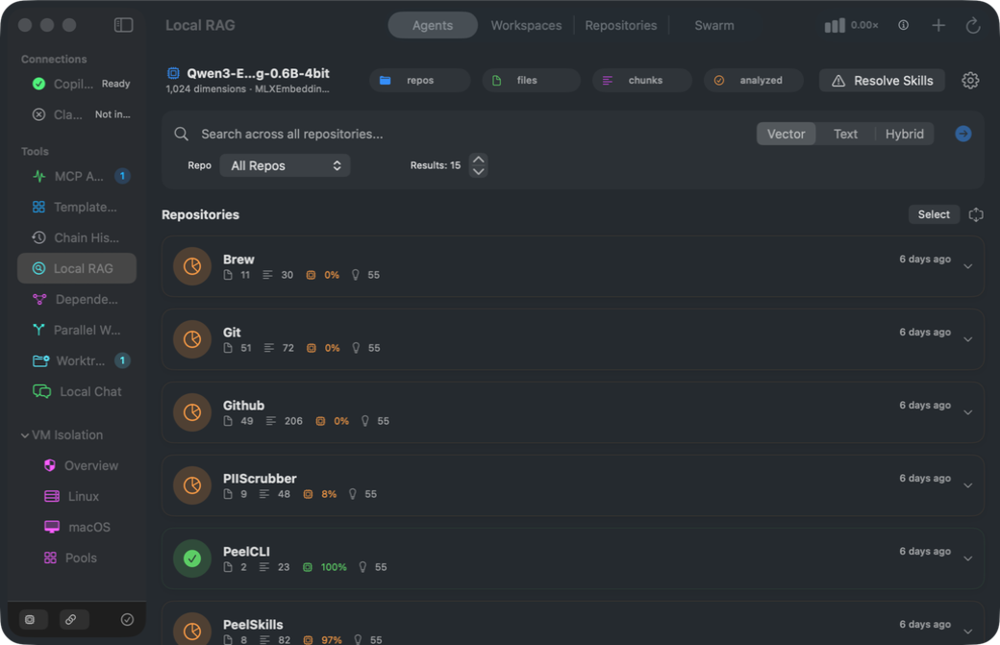
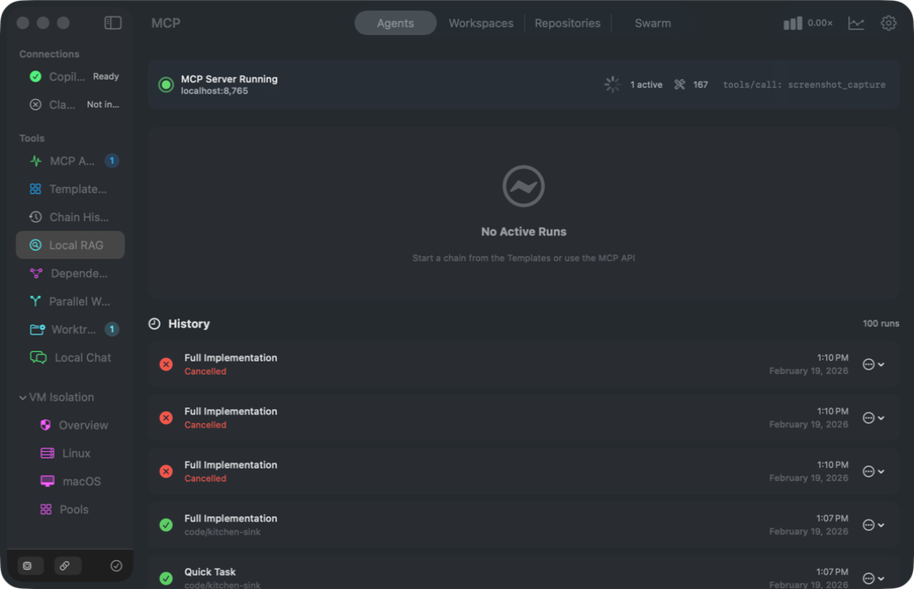
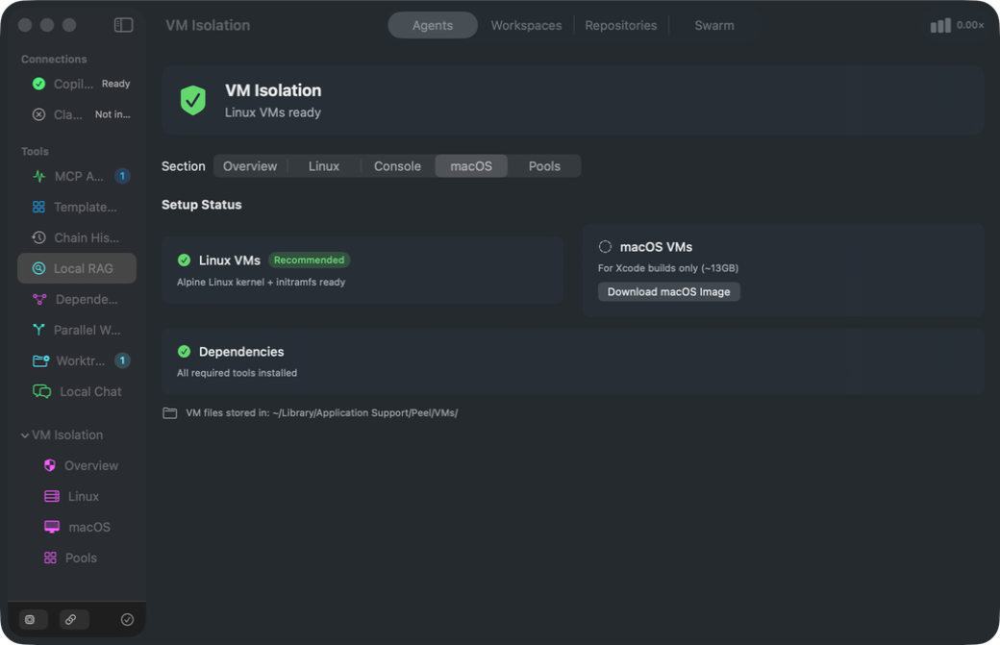
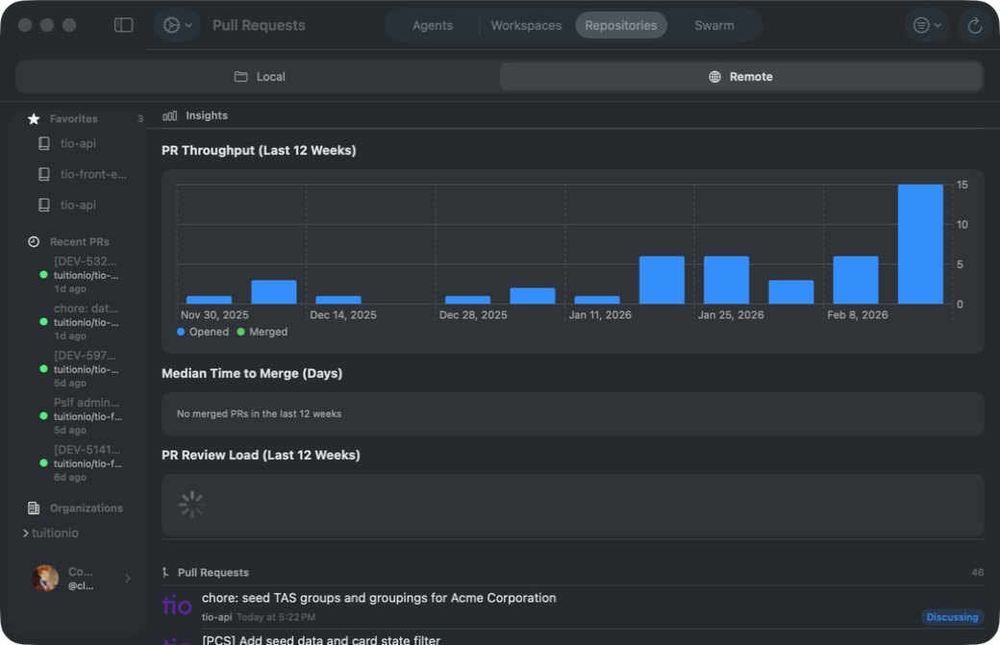
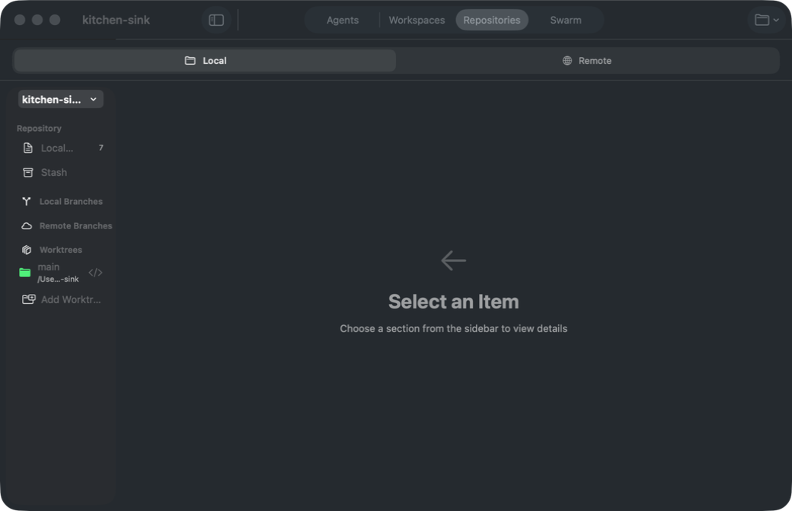
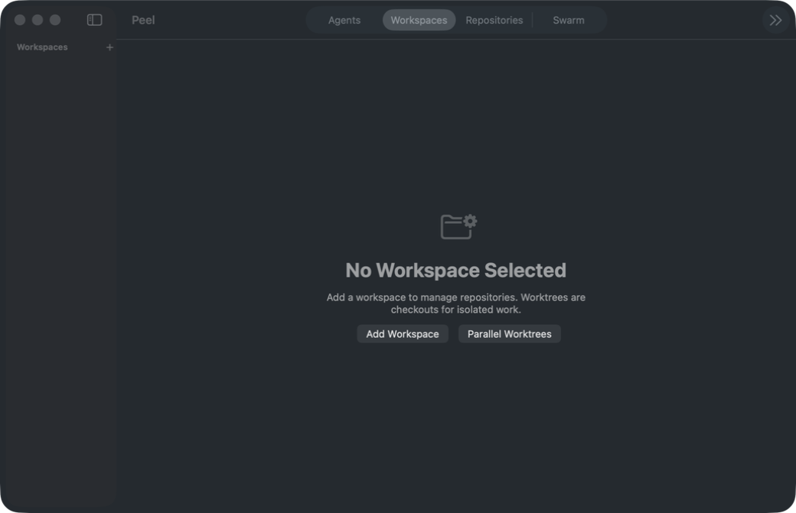

# Peel Product Manual

> "Peel back the layers" of your dev environment

**Version:** 1.0
**Platforms:** macOS 26+, iOS 26
**Last Updated:** February 19, 2026

---

## Table of Contents

1. [Overview](#overview)
2. [Getting Started](#getting-started)
3. [Navigation](#navigation)
4. [Core Features](#core-features)
   - [Agents & Chains](#agents--chains)
   - [Parallel Worktrees](#parallel-worktrees)
   - [Local RAG](#local-rag)
   - [Dependency Graph](#dependency-graph)
   - [Local Chat (MLX)](#local-chat-mlx)
   - [MCP Server](#mcp-server)
   - [Template Gallery](#template-gallery)
   - [Chain History](#chain-history)
   - [Session Summary](#session-summary)
   - [Distributed Swarm](#distributed-swarm)
   - [Worktree Management](#worktree-management)
   - [Prompt Rules](#prompt-rules-guardrails)
   - [Code Editing](#code-editing)
   - [Terminal Tools](#terminal-tools)
   - [PII Scrubber](#pii-scrubber)
   - [Translation Validation](#translation-validation)
   - [Docling Import](#docling-import)
   - [VM Isolation](#vm-isolation)
5. [Integrations](#integrations)
   - [Repositories (Unified)](#repositories-unified)
   - [Git (Local)](#git-local)
   - [GitHub (Remote)](#github-remote)
   - [Homebrew](#homebrew)
   - [Workspaces](#workspaces)
6. [MCP API Reference](#mcp-api-reference)
7. [Configuration](#configuration)
8. [iOS Support](#ios-support)
9. [Troubleshooting](#troubleshooting)

---

## Overview

Peel is a macOS/iOS application for managing your development environment. It provides:

- **AI Agent Orchestration** — Run AI coding agents with review gates, isolated worktrees, and live status tracking
- **Parallel Worktrees** — Execute multiple tasks simultaneously in isolated git worktrees, then review and merge
- **Local RAG** — Index and search your codebase with on-device MLX embeddings, semantic analysis, and learned lessons
- **Dependency Graph** — Interactive D3 force-directed visualization of your codebase module dependencies
- **Local Chat** — Chat with on-device MLX LLM models directly from the app
- **Code Editing** — Edit code using on-device MLX models via MCP
- **Terminal Tools** — Run, analyze, and adapt terminal commands with safety analysis
- **MCP Server** — Model Context Protocol server for connecting to VS Code, Claude, and other IDEs
- **Distributed Swarm** — Scale agent execution across multiple Mac devices via Bonjour LAN or Firestore WAN
- **Git/GitHub Management** — Unified repository view with local and remote repo management
- **Homebrew** — Package management interface
- **Workspace Dashboard** — Multi-repo project management with worktree tracking

### Architecture

```
+------------------------------------------------------------------+
|                           Peel App                                |
+------------------------------------------------------------------+
|  +----------+  +----------+  +----------+  +----------+          |
|  | Agents   |  | Parallel |  |   RAG    |  |  Swarm   |          |
|  | & Chains |  | Worktrees|  | + Chat   |  | (LAN/WAN)|          |
|  +----+-----+  +----+-----+  +----+-----+  +----+-----+          |
|       |              |             |              |                |
|  +----+--------------+-------------+--------------+------+        |
|  |              MCP Server (port 8765)                    |        |
|  |     JSON-RPC interface for external tools              |        |
|  |     120+ tools across 15 categories                    |        |
|  +------------------------+-------------------------------+        |
|                           |                                        |
|  +------------------------+-------------------------------+        |
|  |              Local RAG Store (SQLite + MLX)             |        |
|  |   File chunks - MLX embeddings - HF reranking          |        |
|  |   Dependency graph - Lessons - Skills - Analysis        |        |
|  +---------------------------------------------------------+        |
+------------------------------------------------------------------+
```


---

## Getting Started

### Installation

1. Download Peel from the releases page
2. Move to `/Applications`
3. Launch Peel
4. Grant necessary permissions (File Access, Accessibility if using VM features)

### First Launch

On first launch, Peel will:
1. Initialize the MCP server on port 8765
2. Create the Local RAG database
3. Check for CLI tools (GitHub Copilot CLI, Claude CLI)
4. Show the **Feature Discovery Checklist** — a guided onboarding card that walks you through key setup steps:
   - Add a repository
   - Run an agent chain
   - Index a repo for RAG
   - Connect MCP to your IDE
   - Join or create a swarm

The checklist can be dismissed and re-opened from the toolbar checklist icon.

### Connecting to IDEs

Peel's MCP server can be used with any MCP-compatible IDE:

**VS Code (settings.json):**
```json
{
  "mcp.servers": {
    "peel": {
      "url": "http://127.0.0.1:8765/rpc"
    }
  }
}
```

**Claude Desktop config:**
```json
{
  "mcpServers": {
    "peel": {
      "url": "http://127.0.0.1:8765/rpc"
    }
  }
}
```

### Building from Source

```bash
# Clone and open
git clone https://github.com/cloke/peel.git
cd peel
open Peel.xcodeproj

# Build for macOS
xcodebuild -scheme "Peel (macOS)" -destination 'platform=macOS' build

# Build + launch with MCP server
./Tools/build-and-launch.sh --wait-for-server
```

---

## Navigation

Peel uses a **toolbar-based navigation** system with seven top-level sections:

| Section | Icon | Description |
|---------|------|-------------|
| **Agents** | `cpu` | AI agent orchestration, chains, and all tools |
| **Repositories** | `tray.full` | Unified local + remote repository view |
| **Git** | `arrow.triangle.branch` | Shortcut to Repositories with Local scope |
| **GitHub** | `globe` | Shortcut to Repositories with Remote scope |
| **Workspaces** | `square.grid.2x2` | Multi-repo workspace management |
| **Brew** | `mug` | Homebrew package management (opt-in) |
| **Swarm** | `network` | Distributed swarm dashboard |

The **Agents** section contains a sidebar with sub-navigation to all developer tools:

| Sidebar Item | Description |
|-------------|-------------|
| Running Now | Active chains with live status |
| Active | Running agents |
| Agents | Idle/configured agents |
| Connections | CLI tool status (Copilot, Claude) |
| MCP Activity | MCP server dashboard |
| Template Gallery | Chain template browser |
| Chain History | All past chain runs |
| Local RAG | RAG dashboard with search, skills, lessons |
| Dependency Graph | Interactive D3 module graph |
| Docling Import | Document import (opt-in) |
| PII Scrubber | PII removal tool (opt-in) |
| Translation Validation | i18n validation (opt-in) |
| Parallel Worktrees | Multi-task parallel execution |
| Worktrees | Git worktree management |
| Local Chat | On-device MLX LLM chat |
| VM Isolation | VM management (Overview, Linux, macOS, Pools) |

---

## Core Features

### Agents & Chains

**Location:** Sidebar > Agents tab

Agents are AI coding assistants backed by CLI tools (GitHub Copilot CLI or Claude CLI). Chains are sequences of agent tasks with review gates and live status tracking.

#### Creating an Agent

1. Click **Agent** button in sidebar footer
2. Select CLI tool (Copilot or Claude)
3. Configure agent settings (name, model, role)
4. Agent appears in "Agents" section

#### Creating a Chain

1. Click **Chain** button in sidebar footer
2. Enter chain name and select project
3. Define tasks with prompts and agent roles
4. Choose template (optional) — templates use semantic model tiers (`bestFree`/`bestStandard`/`bestPremium`)
5. Start chain execution

#### Chain Execution & Live Status

When a chain runs, a **Live Status Panel** shows:
- Progress bar across all agents in the chain
- Real-time status messages with timestamps
- Current agent name, elapsed time, and model being used
- MCP prompt that was sent to the agent
- Phase tracking (planning > implementing > reviewing)

#### Review Gates

Chains pause at review gates, allowing you to:
- Review changes made by the agent
- Approve and continue to next task
- Reject and provide feedback
- Stop the chain entirely

#### Chain States

| State | Description |
|-------|-------------|
| Idle | Not started |
| Running | Actively executing |
| Reviewing | Paused at review gate |
| Complete | All tasks finished |
| Failed | Error occurred |

#### Worktree Isolation

All agent work **must** happen inside a git worktree — never in the main repository checkout. When a chain starts:
- A worktree is automatically created under `<repo>/.agent-workspaces/workspace-<UUID>/`
- If worktree creation fails, the chain is rejected with an error
- This ensures parallel execution without conflicts and easy cleanup

#### CI Failure Feedback

When chain tasks fail CI checks, the **CI Failure Feedback** system:
- Records failure patterns and frequency
- Generates guidance that can be injected into future runs
- Shows stats: total failures, unique patterns, guidance generated
- Patterns can be resolved once the underlying issue is fixed

---

### Parallel Worktrees

**Location:** Sidebar > Tools > Parallel Worktrees

Execute multiple tasks simultaneously in isolated git worktrees, then review and merge results.

#### Creating a Parallel Run

1. Navigate to Parallel Worktrees dashboard
2. Click **+** to create a new run
3. Enter run name and select project
4. Add tasks with titles and prompts
5. Configure options:
   - **Base Branch** — Branch to create worktrees from
   - **Target Branch** — Branch to merge into (optional)
   - **Require Review Gate** — Pause before merge
   - **Auto-merge on Approval** — Skip manual merge step

#### Task Dependencies

Tasks within a parallel run can declare dependencies using `dependsOn`:
- Dependent tasks wait until their prerequisites complete
- Independent tasks run in parallel
- Enables complex multi-step workflows within a single run

#### Execution Flow

```
Create Run > Start > [Tasks execute in parallel worktrees]
                            |
                    Awaiting Review
                            |
              Approve/Reject each execution
                            |
                    Merge approved changes
                            |
                        Complete
```

#### Task Status

| Status | Description |
|--------|-------------|
| Pending | Not started |
| Creating Worktree | Setting up isolated worktree |
| Running | Agent executing task |
| Awaiting Review | Ready for review |
| Approved | Approved, ready to merge |
| Rejected | Rejected with feedback |
| Merging | Merging into target branch |
| Merged | Successfully merged |
| Failed | Error occurred |
| Cancelled | Manually cancelled |

#### Merge Conflict Resolution

When parallel tasks modify the same files, Peel has a built-in **Conflict Resolution UI**:
- Shows conflicted files in a split-view
- Left panel: file list with conflict status
- Right panel: diff viewer showing both sides
- Choose resolution per file (ours/theirs/manual edit)
- Apply resolution to commit the merge

#### Additional Parallel Tools

| Tool | Description |
|------|-------------|
| `parallel.diff` | Show unified git diff for an execution's branch vs base |
| `parallel.retry` | Re-queue a failed/rejected execution with amended prompt and/or guidance |
| `parallel.append` | Add new tasks to an in-flight parallel run |

#### Operator Guidance

Parallel runs can be paused and updated mid-flight with additional guidance:
- `parallel.instruct` appends guidance to subsequent prompts
- `parallel.pause` / `parallel.resume` control execution flow

#### RAG Grounding

Each task automatically receives relevant code snippets from Local RAG based on the task description.

#### Sound Notifications

Peel can play sound alerts (PeonPing) when tasks complete or need review.

---

### Local RAG

**Location:** Sidebar > Tools > Local RAG



Local Retrieval-Augmented Generation indexes your codebase for semantic search, entirely on-device using MLX embeddings.

#### Indexing a Repository

1. Navigate to Local RAG dashboard
2. Enter repository path (e.g., `/Users/you/code/myproject`)
3. Click **Index Repository**
4. Wait for indexing to complete

**Auto-resume:** If the app quits during indexing, interrupted operations automatically resume on next launch.

**Branch-aware indexing:** Worktrees and feature branches are indexed separately using `rag.branch.index`, with automatic cleanup when branches are merged via `rag.branch.cleanup`.

**Nightly sync:** Optional automatic nightly re-indexing keeps your RAG database fresh.

#### Search Modes

| Mode | Description | Best For |
|------|-------------|----------|
| Text | Keyword matching with AND/OR | Exact code snippets, function names |
| Vector | Semantic similarity using MLX embeddings | Conceptual queries ("how does auth work") |
| Hybrid | Combined RRF (Reciprocal Rank Fusion) of text + vector | Best overall quality, no API needed |

The **Global Search** bar at the top of the RAG dashboard supports all three modes with a segmented picker.

#### Search Filters

| Filter | Description |
|--------|-------------|
| `excludeTests` | Skip test/spec files |
| `constructType` | Filter by type: `function`, `classDecl`, `component`, `method` |
| `matchAll` | For text mode: `true` = AND all words, `false` = OR any word |

#### Embedding Providers

Configure via RAG Settings (gear button) or MCP (`rag.config`):

| Provider | Description | Quality |
|----------|-------------|---------|
| `mlx` | MLX native — default on Apple Silicon | Best |
| `system` | Apple NLEmbedding | Good |
| `hash` | Fallback hash-based | Basic |

#### MLX Model Selection

The default model is `nomic-embed-text-v1.5` (768 dims). Auto-selects model tier based on available RAM:
- 8GB: MiniLM (smaller, faster)
- 16GB+: nomic (better quality)

```bash
# List available models
curl -X POST http://127.0.0.1:8765/rpc \
  -d '{"jsonrpc":"2.0","id":1,"method":"tools/call","params":{"name":"rag.model.list","arguments":{}}}'

# Set preferred model
curl -X POST http://127.0.0.1:8765/rpc \
  -d '{"jsonrpc":"2.0","id":1,"method":"tools/call","params":{"name":"rag.model.set","arguments":{"modelId":"nomic-ai/nomic-embed-text-v1.5"}}}'
```

#### MLX Settings

From the RAG Settings panel:
- **Memory limit** — Cap MLX memory usage (GB)
- **Clear cache after batch** — Free memory between indexing batches
- **Provider selection** — Switch between mlx/system/hash

#### HuggingFace Reranker

Enable a HuggingFace reranker for improved search result ordering:
- Configure API token and model ID in RAG Settings
- Reranker runs after initial search to re-score results

#### AI Analysis (MLX Analyzer)

Peel can analyze code chunks using a local MLX LLM to generate semantic summaries:
- **Analyze All** button on each repo card processes un-analyzed chunks
- Status shows analyzed vs un-analyzed chunk counts
- Settings persist across launches
- Auto-resume on stall or error

#### Lessons (Error-to-Fix Learning)

The **Lessons** system captures recurring error patterns and their fixes:
- Auto-captured from review loop corrections
- Browse lessons per repo in a split-view editor
- Fields: file pattern, error signature, fix description, fix code, confidence
- Lessons are queried during chain execution to provide fix suggestions
- Mark lessons as applied to improve confidence scoring

#### Skills (Repo Guidance)

**Skills** are short, repo-scoped rules that guide agents:
- Live on-device (can be exported/imported via `.peel/skills.json`)
- Injected into chain and parallel prompts automatically
- Track usage count for feedback
- **Ember detection** — Peel can auto-detect skill candidates from your codebase patterns
- **Export/Import/Sync** — Share skills via `rag.skills.export`, `rag.skills.import`, `rag.skills.sync`

#### Index Management

```bash
# View indexed repos
curl -X POST http://127.0.0.1:8765/rpc \
  -d '{"jsonrpc":"2.0","id":1,"method":"tools/call","params":{"name":"rag.repos.list","arguments":{}}}'

# Force re-index
curl -X POST http://127.0.0.1:8765/rpc \
  -d '{"jsonrpc":"2.0","id":1,"method":"tools/call","params":{"name":"rag.index","arguments":{"repoPath":"/path/to/repo","forceReindex":true}}}'

# Clear embedding cache
curl -X POST http://127.0.0.1:8765/rpc \
  -d '{"jsonrpc":"2.0","id":1,"method":"tools/call","params":{"name":"rag.cache.clear","arguments":{}}}'
```

#### Analytics & Code Intelligence

```bash
# Index statistics
curl -X POST http://127.0.0.1:8765/rpc \
  -d '{"jsonrpc":"2.0","id":1,"method":"tools/call","params":{"name":"rag.stats","arguments":{}}}'

# Find large files (refactor candidates)
curl -X POST http://127.0.0.1:8765/rpc \
  -d '{"jsonrpc":"2.0","id":1,"method":"tools/call","params":{"name":"rag.largefiles","arguments":{"limit":10}}}'

# Find code hotspots
curl -X POST http://127.0.0.1:8765/rpc \
  -d '{"jsonrpc":"2.0","id":1,"method":"tools/call","params":{"name":"rag.hotspots","arguments":{}}}'

# Detect duplicate code
curl -X POST http://127.0.0.1:8765/rpc \
  -d '{"jsonrpc":"2.0","id":1,"method":"tools/call","params":{"name":"rag.duplicates","arguments":{}}}'

# Get construct type distribution
curl -X POST http://127.0.0.1:8765/rpc \
  -d '{"jsonrpc":"2.0","id":1,"method":"tools/call","params":{"name":"rag.constructtypes","arguments":{}}}'

# Find potentially orphaned files
curl -X POST http://127.0.0.1:8765/rpc \
  -d '{"jsonrpc":"2.0","id":1,"method":"tools/call","params":{"name":"rag.orphans","arguments":{}}}'

# Check known patterns
curl -X POST http://127.0.0.1:8765/rpc \
  -d '{"jsonrpc":"2.0","id":1,"method":"tools/call","params":{"name":"rag.patterns","arguments":{}}}'

# Browse facets (language, type distribution)
curl -X POST http://127.0.0.1:8765/rpc \
  -d '{"jsonrpc":"2.0","id":1,"method":"tools/call","params":{"name":"rag.facets","arguments":{}}}'

# Find similar code chunks
curl -X POST http://127.0.0.1:8765/rpc \
  -d '{"jsonrpc":"2.0","id":1,"method":"tools/call","params":{"name":"rag.similar","arguments":{"chunkId":"...","limit":5}}}'
```

#### Structural Queries

```bash
# Files with 50+ methods
curl -X POST http://127.0.0.1:8765/rpc \
  -d '{"jsonrpc":"2.0","id":1,"method":"tools/call","params":{"name":"rag.structural","arguments":{"repoPath":"/path/to/repo","minMethods":50}}}'

# Large files (500+ lines)
curl -X POST http://127.0.0.1:8765/rpc \
  -d '{"jsonrpc":"2.0","id":1,"method":"tools/call","params":{"name":"rag.structural","arguments":{"repoPath":"/path/to/repo","minLines":500}}}'

# Aggregate stats only
curl -X POST http://127.0.0.1:8765/rpc \
  -d '{"jsonrpc":"2.0","id":1,"method":"tools/call","params":{"name":"rag.structural","arguments":{"repoPath":"/path/to/repo","statsOnly":true}}}'
```

---

### Dependency Graph

**Location:** Sidebar > Tools > Dependency Graph

An interactive **D3 force-directed graph** rendered in a WebView showing your codebase module structure.

#### Features

- **Module-level view** — Shows top-level modules and their inter-dependencies
- **Submodule-level view** — Drill into module internals
- **File-level view** — See individual file relationships
- **Node details** — File count, top language, language breakdown
- **Edge details** — Weight, dependency types (import, inherit, conform, include, extend)
- **Stats** — Total files, total/resolved/inferred dependencies, module count

#### Dependency Types

| Type | Description | Languages |
|------|-------------|-----------|
| `import` | Module/package import | Swift, TS/JS, Ruby |
| `require` | CommonJS require | JavaScript |
| `include` | Ruby module include | Ruby |
| `extend` | Ruby module extend | Ruby |
| `inherit` | Class inheritance | Swift, TS/JS, Ruby |
| `conform` | Protocol conformance | Swift |

#### MCP Usage

```bash
# What does a file depend on?
curl -X POST http://127.0.0.1:8765/rpc \
  -d '{"jsonrpc":"2.0","id":1,"method":"tools/call","params":{"name":"rag.dependencies","arguments":{"filePath":"Shared/PeelApp.swift","repoPath":"/path/to/repo"}}}'

# What depends on a file?
curl -X POST http://127.0.0.1:8765/rpc \
  -d '{"jsonrpc":"2.0","id":1,"method":"tools/call","params":{"name":"rag.dependents","arguments":{"filePath":"Shared/PeelApp.swift","repoPath":"/path/to/repo"}}}'
```

---

### Local Chat (MLX)

**Location:** Sidebar > Tools > Local Chat

Chat with on-device MLX language models without any cloud API.

#### Features

- **Streaming responses** — Real-time token generation
- **Model tier selection** — Auto (recommended), or manual tier choice
- **Tokens/sec display** — Real-time performance indicator
- **Conversation history** — Messages persist within session
- **Model management** — Load/unload/switch models

#### Model Tiers

Peel auto-selects based on available RAM:
- **Auto** — Recommended: picks the best model for your hardware
- Manual tiers let you choose smaller (faster) or larger (smarter) models

Default models:
- 96GB+ RAM: Qwen3-Coder-Next (large, high quality)
- 16GB-96GB: Qwen2.5-Coder-7B (balanced)
- 8GB: Smaller quantized models

#### Controls

- **Send** — Submit your message (Enter key)
- **Stop** — Cancel generation mid-stream
- **Clear** — Reset conversation history
- **Model picker** — Switch model tiers

---

### MCP Server

**Location:** Sidebar > Tools > MCP Activity



The Model Context Protocol server exposes Peel's functionality to external tools via JSON-RPC on port 8765.

#### Status Indicators

- Green **Running** — Server is active and accepting connections
- Red **Stopped** — Server is not running
- **Active Requests** — Badge shows in-flight requests in the sidebar

#### Viewing Activity

The MCP Dashboard shows:
- Recent requests with timing
- Request/response payloads
- Error details
- Tool invocation history

#### LAN Mode

Enable LAN mode to allow other devices on your network to connect:

```bash
curl -X POST http://127.0.0.1:8765/rpc \
  -d '{"jsonrpc":"2.0","id":1,"method":"tools/call","params":{"name":"server.lan","arguments":{"enabled":true}}}'
```

#### Session Tracking

Click the usage indicator in the toolbar to see the **Session Summary**:
- Premium request multiplier used
- Session duration
- Chain run count
- Per-run history with model and cost breakdown

---

### Template Gallery

**Location:** Sidebar > Tools > Template Gallery

Pre-configured chain templates for common workflows. Templates use **semantic model tiers** (`bestFree`, `bestStandard`, `bestPremium`) to automatically pick the right model for each task step.

#### Built-in Templates

| Template | Description | Tasks |
|----------|-------------|-------|
| Code Review | Review PR changes | Analyze, suggest improvements |
| Bug Fix | Fix reported issue | Reproduce, diagnose, fix, test |
| Feature Implementation | Build new feature | Plan, implement, test, document |
| Refactoring | Improve code structure | Analyze, refactor, verify |
| Documentation | Update docs | Audit, write, review |
| Free Review | Low-cost validation run | Quick review using free models |

#### Creating Custom Templates

1. Complete a successful chain
2. Click **Save as Template**
3. Edit template metadata
4. Template appears in gallery

#### Template Structure

```json
{
  "id": "uuid",
  "name": "My Template",
  "description": "What this template does",
  "tasks": [
    {
      "name": "Task 1",
      "prompt": "Instructions for the agent",
      "modelTier": "bestStandard",
      "reviewRequired": true
    }
  ],
  "variables": ["PROJECT_PATH", "ISSUE_NUMBER"]
}
```

---

### Chain History

**Location:** Sidebar > Tools > Chain History

Full-width view of all chain runs (past and present), replacing the old inline sidebar display.

- Sorted by most recent
- Shows: chain name, state, agent count, premium cost, relative time
- Click any row to view the full chain detail with live status panel

---

### Session Summary

**Location:** Toolbar usage indicator (chart icon + cost display)

Shows aggregate session statistics:
- **Premium Requests** — total premium multiplier consumed
- **Session Duration** — time since app launch
- **Chain Runs** — count of chain executions
- **Run History** — per-run details with agent names, models, durations, and costs

Includes an export button for sharing session data.

---

### Distributed Swarm

**Location:** Top navigation > Swarm

Scale AI agent execution across multiple Mac devices. Supports both **Bonjour LAN** discovery and **Firestore WAN** coordination.

#### Naming (Banana Theme)

| Term | Purpose |
|------|---------|
| **Crown** | The leader that coordinates tasks and queues across the swarm |
| **Tree** | A powerful node for heavy workloads |
| **Peel** | A regular node that executes tasks |
| **Sprout** | An idle Peel that auto-requests work |
| **Bunch** | The full swarm of connected devices |

#### Architecture

```
+-------------------------------------------------------------+
|                          Crown (Leader)                       |
|  +-------------+  +-------------+  +-------------+           |
|  | Task Queue  |  | PR Queue    |  | Branch Queue|           |
|  +-------------+  +-------------+  +-------------+           |
+---------------------------+-----+----------------------------+
                            | Bonjour / Firestore
          +-----------------+-----------------+
          v                 v                 v
    +----------+      +----------+      +----------+
    | Peel 1   |      | Peel 2   |      | Tree 1   |
    | (Mac Mini)|     | (MacBook)|      | (Mac Pro)|
    +----------+      +----------+      +----------+
```

#### Bonjour LAN Discovery

For devices on the same local network:
1. Navigate to Swarm tab
2. Click **Start** — the coordinator starts and listens for peers
3. Other Peel instances auto-discover via Bonjour and connect
4. Dispatch tasks from the Crown to workers

#### Firestore WAN Coordination

For devices across different networks:
1. **Sign in** with your account (swarm auth view)
2. **Create a swarm** or join an existing one via invite link
3. **Register as a worker** in the swarm
4. Tasks are dispatched through Firestore as the coordination layer
5. **Invite links** with QR codes can be shared for easy onboarding

#### Swarm Management UI

The Swarm Management view (Firestore mode) provides:
- **Sidebar** — List of swarms you belong to
- **Detail view** — Members, workers, pending tasks
- **Invite creation** — Generate invite links/QR codes
- **Worker registration** — Register your repos for task execution

#### RAG Artifact Sync

Push/pull RAG indices between swarm members:
```bash
# Push local RAG to swarm
curl -X POST http://127.0.0.1:8765/rpc \
  -d '{"jsonrpc":"2.0","id":1,"method":"tools/call","params":{"name":"swarm.firestore.rag.push","arguments":{}}}'

# Pull RAG from swarm
curl -X POST http://127.0.0.1:8765/rpc \
  -d '{"jsonrpc":"2.0","id":1,"method":"tools/call","params":{"name":"swarm.firestore.rag.pull","arguments":{}}}'
```

#### Worktree Tracking

Swarm-created worktrees are tracked in SwiftData with `source: "swarm"` and show disk sizes in the UI.

#### Swarm Auto-Start

Swarm can be configured to auto-start on app launch (enabled by default).

---

### Worktree Management

**Location:** Sidebar > Tools > Worktrees

Manage git worktrees across all your repositories:
- View all active worktrees
- Create new worktrees
- Remove finished worktrees
- Per-worktree Xcode build isolation (separate derived data paths)
- Global build queue for coordinating builds across worktrees

---

### Prompt Rules (Guardrails)

Define guardrails and rules that apply to all chain executions.

```bash
# Get current rules
curl -X POST http://127.0.0.1:8765/rpc \
  -d '{"jsonrpc":"2.0","id":1,"method":"tools/call","params":{"name":"chains.promptRules.get","arguments":{}}}'

# Set rules
curl -X POST http://127.0.0.1:8765/rpc \
  -d '{"jsonrpc":"2.0","id":1,"method":"tools/call","params":{"name":"chains.promptRules.set","arguments":{"rules":"- Never commit directly to main\n- Always run tests before completing\n- Use conventional commit messages"}}}'
```

Rules are prepended to every agent prompt, ensuring consistent behavior across all chain and swarm executions.

---

### Code Editing

**Location:** Available via MCP tools

Edit code files using on-device MLX models. This allows agents and external tools to make targeted code changes without cloud API calls.

```bash
# Edit a file
curl -X POST http://127.0.0.1:8765/rpc \
  -d '{"jsonrpc":"2.0","id":1,"method":"tools/call","params":{"name":"code.edit","arguments":{"filePath":"/path/to/file.swift","instruction":"Add error handling to this function"}}}'

# Check status
curl -X POST http://127.0.0.1:8765/rpc \
  -d '{"jsonrpc":"2.0","id":1,"method":"tools/call","params":{"name":"code.edit.status","arguments":{}}}'

# Unload model to free memory
curl -X POST http://127.0.0.1:8765/rpc \
  -d '{"jsonrpc":"2.0","id":1,"method":"tools/call","params":{"name":"code.edit.unload","arguments":{}}}'
```

---

### Terminal Tools

**Location:** Available via MCP tools

Run shell commands with safety analysis and environment adaptation.

```bash
# Run a command
curl -X POST http://127.0.0.1:8765/rpc \
  -d '{"jsonrpc":"2.0","id":1,"method":"tools/call","params":{"name":"terminal.run","arguments":{"command":"ls -la","workingDirectory":"/path/to/repo"}}}'

# Analyze terminal output
curl -X POST http://127.0.0.1:8765/rpc \
  -d '{"jsonrpc":"2.0","id":1,"method":"tools/call","params":{"name":"terminal.analyze","arguments":{"output":"error: could not compile..."}}}'

# Adapt a command for the current environment (e.g., bash to zsh)
curl -X POST http://127.0.0.1:8765/rpc \
  -d '{"jsonrpc":"2.0","id":1,"method":"tools/call","params":{"name":"terminal.adapt","arguments":{"command":"apt-get install foo"}}}'
```

The terminal tools include:
- **Safety analysis** — Commands are checked before execution
- **Environment adaptation** — Automatically adapts commands for the current shell (bash vs zsh) and OS
- **Output analysis** — Parse and explain terminal output

---

### PII Scrubber

**Location:** Sidebar > Tools > PII Scrubber *(opt-in via Settings)*

Remove personally identifiable information from datasets before sharing or training.

#### Supported PII Types

- Email addresses
- Phone numbers
- Social Security Numbers
- Credit card numbers
- IP addresses
- Names (with NER option)
- Custom patterns (via config)

---

### Translation Validation

**Location:** Sidebar > Tools > Translation Validation *(opt-in via Settings)*

Validate i18n translation files for consistency and completeness.

#### Checks Performed

- Missing keys across locales
- Placeholder mismatches
- Empty translations
- Duplicate keys
- Invalid interpolation syntax

---

### Docling Import

**Location:** Sidebar > Tools > Docling Import *(opt-in via Settings)*

Import policy documents using Docling with progress tracking and improved error handling.

#### Features

- Document conversion pipeline with Docling setup flow
- Policy version history and comparison (diff view)
- Policy export for team sharing
- Progress indicators during import

---

### VM Isolation

**Location:** Sidebar > Tools > VM Isolation (Overview / Linux / macOS / Pools)



Run agents in isolated virtual machines for security.

#### Sub-sections

| Section | Description |
|---------|-------------|
| Overview | VM status summary |
| Linux | Linux VM management and lifecycle |
| macOS | macOS VM management (Virtualization.framework) |
| Pools | VM pool management for scaling |

#### Requirements

- macOS with Virtualization.framework
- VM image (Linux or macOS)

#### Status

Under Development — Basic VM lifecycle management available. Full agent-in-VM execution maturing.

---

## Integrations

### Repositories (Unified)

**Location:** Top navigation > Repositories



The unified Repositories view combines local and remote repositories in one place with a scope picker:

| Scope | Description |
|-------|-------------|
| **Local** | Git repositories on your machine |
| **Remote** | GitHub repositories (owned, starred, organizations) |

Switch between scopes using the segmented picker at the top. The **Git** and **GitHub** toolbar items are shortcuts to this view with the respective scope pre-selected.

### Git (Local)

**Location:** Repositories > Local



Local git repository management:
- Repository browser
- Branch management
- Commit history
- Diff viewer
- Stash management
- Worktree integration

### GitHub (Remote)

**Location:** Repositories > Remote


GitHub integration for repository and PR management.

#### Authentication

1. First launch prompts for GitHub authentication
2. OAuth flow completes in browser
3. Token stored securely in Keychain

#### Features

- Repository list (owned, starred, organizations)
- Pull request management
- Issue browser
- Review comments
- PR creation from chains
- GitHub Actions status

### Homebrew

**Location:** Top navigation > Brew *(opt-in via Settings)*

Homebrew package management interface:
- Installed packages list
- Available updates
- Package search with streaming output
- Install/uninstall packages
- Cask support

### Workspaces

**Location:** Top navigation > Workspaces



Multi-repository project management:
- Group related repositories into workspaces
- Per-workspace worktree tracking
- Repository selection with detail view
- Workspace-wide operations

---

## MCP API Reference

The MCP server exposes 120+ tools via JSON-RPC at `http://127.0.0.1:8765/rpc`.

### Chains

| Tool | Description |
|------|-------------|
| `chains.run` | Run a chain with a prompt (auto-creates worktree) |
| `chains.runBatch` | Run multiple chains (accepts `runs` array with per-item templateId) |
| `chains.run.status` | Get status for a running or queued chain |
| `chains.run.list` | List recent chain runs |
| `chains.pause` | Pause a running chain |
| `chains.resume` | Resume a paused chain |
| `chains.step` | Step a paused chain to the next agent |
| `chains.instruct` | Inject operator guidance into a running chain |
| `chains.queue.status` | Get chain queue status |
| `chains.queue.configure` | Configure chain queue limits |
| `chains.queue.cancel` | Cancel a queued chain |
| `chains.stop` | Stop a running chain |
| `chains.promptRules.get` | Get prompt rules (guardrails) |
| `chains.promptRules.set` | Set prompt rules (guardrails) |

### Templates

| Tool | Description |
|------|-------------|
| `templates.list` | List available templates |

### RAG — Indexing & Management

| Tool | Description |
|------|-------------|
| `rag.status` | Get RAG store status |
| `rag.init` | Initialize the RAG database |
| `rag.index` | Index a repository (supports `forceReindex`) |
| `rag.branch.index` | Index a specific branch/worktree |
| `rag.branch.cleanup` | Clean up branch-specific index data |
| `rag.repos.list` | List indexed repositories |
| `rag.repos.delete` | Delete a repo from the index |
| `rag.cache.clear` | Clear embedding cache |
| `rag.config` | Get/set RAG configuration (provider, etc.) |
| `rag.ui.status` | Fetch Local RAG dashboard snapshot |

### RAG — Search & Discovery

| Tool | Description |
|------|-------------|
| `rag.search` | Search indexed code (text, vector, or hybrid modes) |
| `rag.similar` | Find similar code chunks |
| `rag.dependencies` | Get what a file imports/inherits/conforms to |
| `rag.dependents` | Get what depends on a file (reverse lookup) |
| `rag.orphans` | Find potentially unused files |
| `rag.structural` | Query by structural characteristics (lines, methods, size) |
| `rag.duplicates` | Detect duplicate code |
| `rag.hotspots` | Find change hotspots |
| `rag.facets` | Browse language/type facets |
| `rag.patterns` | Check known code patterns |
| `rag.stats` | Get index statistics |
| `rag.largefiles` | Find large files (refactor candidates) |
| `rag.constructtypes` | Get construct type distribution |
| `rag.queryhints` | Get query optimization hints |

### RAG — Embedding & Models

| Tool | Description |
|------|-------------|
| `rag.model.describe` | Describe the current embedding model |
| `rag.model.list` | List available models |
| `rag.model.set` | Set preferred embedding model |
| `rag.embedding.test` | Test embedding generation (verify dimensions, timing) |
| `rag.reranker.config` | Configure HuggingFace reranker |

### RAG — Analysis & Enrichment

| Tool | Description |
|------|-------------|
| `rag.analyze` | Analyze chunks with local MLX LLM |
| `rag.analyze.status` | Get analysis progress (analyzed vs un-analyzed) |
| `rag.enrich` | Enrich chunks with additional metadata |
| `rag.enrich.status` | Get enrichment progress |
| `rag.scratch` | Scratch area for experimental operations |

### RAG — Lessons

| Tool | Description |
|------|-------------|
| `rag.lessons.list` | List learned error-to-fix lessons |
| `rag.lessons.add` | Add a new lesson |
| `rag.lessons.query` | Search lessons by error signature |
| `rag.lessons.update` | Update an existing lesson |
| `rag.lessons.delete` | Delete a lesson |
| `rag.lessons.applied` | Mark lesson as applied (confidence feedback) |

### RAG — Skills

| Tool | Description |
|------|-------------|
| `rag.skills.list` | List repo guidance skills |
| `rag.skills.add` | Add a skill |
| `rag.skills.update` | Update a skill |
| `rag.skills.delete` | Delete a skill |
| `rag.skills.export` | Export skills to `.peel/skills.json` |
| `rag.skills.import` | Import skills from `.peel/skills.json` |
| `rag.skills.sync` | Sync skills with `.peel/skills.json` |
| `rag.skills.ember.detect` | Auto-detect skill candidates from code patterns |
| `rag.skills.ember.update` | Update ember-detected skills |

### Parallel Worktrees

| Tool | Description |
|------|-------------|
| `parallel.create` | Create parallel run |
| `parallel.start` | Start execution |
| `parallel.status` | Get run status |
| `parallel.list` | List all runs |
| `parallel.approve` | Approve execution |
| `parallel.reject` | Reject execution |
| `parallel.reviewed` | Mark execution reviewed without approving |
| `parallel.merge` | Merge approved changes |
| `parallel.pause` | Pause a parallel run |
| `parallel.resume` | Resume a paused run |
| `parallel.instruct` | Inject guidance into a run or execution |
| `parallel.cancel` | Cancel run |
| `parallel.diff` | Show unified git diff for an execution vs base |
| `parallel.retry` | Re-queue a failed/rejected execution with amended prompt |
| `parallel.append` | Add new tasks to an in-flight parallel run |

### Worktrees

| Tool | Description |
|------|-------------|
| `worktree.create` | Create a git worktree |
| `worktree.list` | List worktrees |
| `worktree.remove` | Remove a worktree |
| `worktree.stats` | Get worktree statistics |

### Git

| Tool | Description |
|------|-------------|
| `git.status` | Repository status |
| `git.add` | Stage files |
| `git.commit` | Create commit |
| `git.push` | Push to remote |
| `git.log` | View commit log |

### Repositories

| Tool | Description |
|------|-------------|
| `repos.list` | List tracked repositories |
| `repos.delete` | Remove a tracked repository |
| `repos.resolve` | Resolve a repository path |

### Swarm (LAN via Bonjour)

| Tool | Description |
|------|-------------|
| `swarm.start` | Start the swarm coordinator |
| `swarm.stop` | Stop the swarm coordinator |
| `swarm.status` | Get coordinator status |
| `swarm.dispatch` | Dispatch a task to the swarm |
| `swarm.tasks` | Get task results |
| `swarm.workers` | List connected workers |
| `swarm.discovered` | List discovered peers on the network |
| `swarm.connect` | Manually connect to a peer |
| `swarm.repos` | List registered repositories |
| `swarm.diagnostics` | Get swarm diagnostics info |
| `swarm.rag.sync` | Sync RAG data across swarm |
| `swarm.register-repo` | Register a repo for swarm task execution |
| `swarm.setup-labels` | Set up swarm labels |
| `swarm.direct-command` | Send a command to a specific worker |
| `swarm.update-workers` | Push configuration to workers |
| `swarm.update-log` | View swarm update history |
| `swarm.create-pr` | Create a PR from swarm work |
| `swarm.branch-queue` | Manage branch queue |
| `swarm.pr-queue` | Manage PR queue |

### Swarm (Firestore/WAN)

| Tool | Description |
|------|-------------|
| `swarm.firestore.auth` | Check Firestore authentication status |
| `swarm.firestore.swarms` | List swarms you belong to |
| `swarm.firestore.create` | Create a new Firestore swarm |
| `swarm.firestore.workers` | List workers in a swarm |
| `swarm.firestore.register-worker` | Register as a worker |
| `swarm.firestore.unregister-worker` | Unregister a worker |
| `swarm.firestore.submit-task` | Submit a task to the swarm |
| `swarm.firestore.tasks` | List pending/running tasks |
| `swarm.firestore.activity` | View swarm activity log |
| `swarm.firestore.debug` | Debug Firestore connection |
| `swarm.firestore.rag.artifacts` | List RAG artifacts in the swarm |
| `swarm.firestore.rag.push` | Push local RAG index to swarm |
| `swarm.firestore.rag.pull` | Pull RAG index from swarm |
| `swarm.firestore.rag.delete` | Delete a RAG artifact |

### Code Editing

| Tool | Description |
|------|-------------|
| `code.edit` | Edit code using local MLX models |
| `code.edit.status` | Check edit operation status |
| `code.edit.unload` | Unload code editing model |

### Terminal

| Tool | Description |
|------|-------------|
| `terminal.run` | Run a command in a sandboxed terminal |
| `terminal.analyze` | Analyze terminal output |
| `terminal.adapt` | Adapt terminal commands for the current environment |

### Docling

| Tool | Description |
|------|-------------|
| `docling.convert` | Convert documents via Docling |
| `docling.setup` | Set up Docling environment |

### UI Automation

| Tool | Description |
|------|-------------|
| `ui.navigate` | Navigate to a view |
| `ui.tap` | Trigger a UI action |
| `ui.setText` | Set text for a control |
| `ui.toggle` | Toggle a control |
| `ui.select` | Select a value for a control |
| `ui.back` | Navigate back |
| `ui.snapshot` | Get current UI state |

### App Lifecycle

| Tool | Description |
|------|-------------|
| `app.activate` | Bring the app to the foreground |
| `app.quit` | Quit the app |
| `screenshot.capture` | Capture a screenshot |

### Server Management

| Tool | Description |
|------|-------------|
| `server.status` | Get MCP server status |
| `server.restart` | Restart the MCP server |
| `server.stop` | Stop the MCP server |
| `server.port.set` | Change the MCP server port |
| `server.lan` | Enable/disable LAN mode |
| `server.sleep.prevent` | Prevent system sleep during operations |
| `server.sleep.prevent.status` | Check sleep prevention status |

### Utilities

| Tool | Description |
|------|-------------|
| `pii.scrub` | Scrub PII from files |
| `translations.validate` | Validate translation files |

### Example Request

```bash
curl -X POST http://127.0.0.1:8765/rpc \
  -H 'Content-Type: application/json' \
  -d '{
    "jsonrpc": "2.0",
    "id": 1,
    "method": "tools/call",
    "params": {
      "name": "rag.search",
      "arguments": {
        "query": "authentication middleware",
        "repoPath": "/Users/me/myproject",
        "mode": "hybrid",
        "limit": 5
      }
    }
  }'
```

---

## Configuration

### App Settings

Access via **Peel > Settings** (Cmd+Comma)

| Setting | Description | Default |
|---------|-------------|---------|
| MCP Port | Server port | 8765 |
| MCP Enabled | Enable/disable server | true |
| RAG Auto-index | Index repos automatically | false |
| Review Gate Default | Require review by default | true |
| Show Brew | Show Homebrew tab | false |
| Show PII Scrubber | Show PII Scrubber tool | false |
| Show Docling Import | Show Docling Import tool | false |
| Show Translation Validation | Show Translation Validation tool | false |
| PeonPing Sounds | Play notification sounds | configurable |
| Swarm Auto-Start | Auto-start swarm on launch | true |

### CLI Tools

Peel detects and uses these CLI tools:

| Tool | Detection | Purpose |
|------|-----------|---------|
| GitHub Copilot CLI | `gh copilot` | Agent execution |
| Claude CLI | `claude` | Agent execution |
| Git | `/usr/bin/git` | Repository operations |
| Homebrew | `/opt/homebrew/bin/brew` | Package management |

### Data Locations

| Data | Location |
|------|----------|
| App Data | `~/Library/Containers/crunchy-bananas.Peel/Data/` |
| RAG Database | `[App Data]/Library/Application Support/Peel/RAG/` |
| MLX Models | Auto-downloaded from HuggingFace on first use |
| Templates | `[App Data]/Library/Application Support/Peel/Templates/` |
| Logs | `[App Data]/Library/Logs/Peel/` |
| Agent Worktrees | `<repo>/.agent-workspaces/workspace-<UUID>/` |

---

## iOS Support

Peel is available on iOS 26 with a subset of features:

### Feature Matrix

| Feature | macOS | iOS |
|---------|-------|-----|
| Repositories (Remote) | Yes | Yes |
| Repositories (Local) | Yes | No |
| GitHub (OAuth, PRs, Issues) | Yes | Yes |
| Git Operations | Yes | No |
| Agents & Chains | Yes | No |
| MCP Server | Yes | No |
| Local RAG | Yes | No |
| Local Chat (MLX) | Yes | No |
| Parallel Worktrees | Yes | No |
| Homebrew | Yes | No |
| VM Isolation | Yes | No |
| Swarm (Monitor) | Yes | Read-only |
| Swarm (Firestore Auth) | Yes | Yes |
| iCloud Sync (SwiftData) | Yes | Yes |

iOS uses a **TabView** with four tabs: Repositories, Brew (placeholder), Agents (placeholder), and Swarm (monitor view).

---

## Troubleshooting

### MCP Server Not Responding

1. Check server status in MCP Activity dashboard
2. Verify port 8765 is not in use: `lsof -i :8765`
3. Restart the app
4. Check Console.app for errors

### RAG Search Returns No Results

1. Verify repository is indexed (check RAG dashboard)
2. Try different search mode (text, vector, or hybrid)
3. Re-index the repository with `forceReindex: true`
4. Check embedding provider is configured (`rag.config`)

### RAG Indexing Stalls

1. Check if the app was interrupted — it will auto-resume on next launch
2. Cancel and re-start from the RAG dashboard
3. Check memory usage — MLX models need sufficient RAM
4. Try `rag.cache.clear` and re-index

### Chain Stuck in Running State

1. Check live status panel in chain detail view
2. Verify CLI tool is responding: `gh copilot --version` or `claude --version`
3. Use `chains.stop` via MCP to force stop
4. Check for worktree conflicts

### Worktree Creation Fails

1. Verify the repo has a clean state (`git status`)
2. Clean up orphaned worktrees: `git worktree prune`
3. Check for locked files in `.git/worktrees/`
4. Verify disk space

### Parallel Merge Conflicts

1. Use the built-in Conflict Resolution UI
2. Or manually resolve in the worktree directory
3. Use `parallel.retry` to re-run failed executions with updated guidance

### GitHub Authentication Failed

1. Re-authenticate via Repositories > Remote
2. Check token in Keychain Access
3. Verify token scopes include `repo`

### Swarm Workers Not Connecting

1. Verify both devices are on the same network (for Bonjour)
2. Check firewall settings — Bonjour requires mDNS
3. For Firestore: verify both devices are signed in and in the same swarm
4. Check `swarm.diagnostics` output

### Build Issues

```bash
# Clean and rebuild
rm -rf build/Build/Intermediates.noindex
xcodebuild -scheme "Peel (macOS)" -destination 'platform=macOS' build

# Build with MCP
./Tools/build-and-launch.sh --wait-for-server
```

---

## Appendix

### Keyboard Shortcuts

| Shortcut | Action |
|----------|--------|
| Cmd+N | New Chain |
| Cmd+Shift+N | New Agent |
| Cmd+Comma | Settings |
| Cmd+R | Refresh current view |
| Cmd+1 through 7 | Switch tabs |

### Glossary

| Term | Definition |
|------|------------|
| **Chain** | Sequence of agent tasks with review gates |
| **MCP** | Model Context Protocol — standard for AI tool communication |
| **RAG** | Retrieval-Augmented Generation — grounding AI with relevant context |
| **Worktree** | Git feature for multiple working directories from one repo |
| **Review Gate** | Pause point in chain for human review |
| **Ember** | Auto-detected skill candidates from code patterns |
| **RRF** | Reciprocal Rank Fusion — method to combine text and vector search |
| **Crown** | Swarm leader node |
| **Peel/Tree** | Swarm worker nodes |
| **Bunch** | The full swarm of connected devices |
| **Skill** | Repo-scoped guidance rule injected into agent prompts |
| **Lesson** | Learned error-to-fix pattern for future agent runs |

---

*Last Updated: February 19, 2026*
